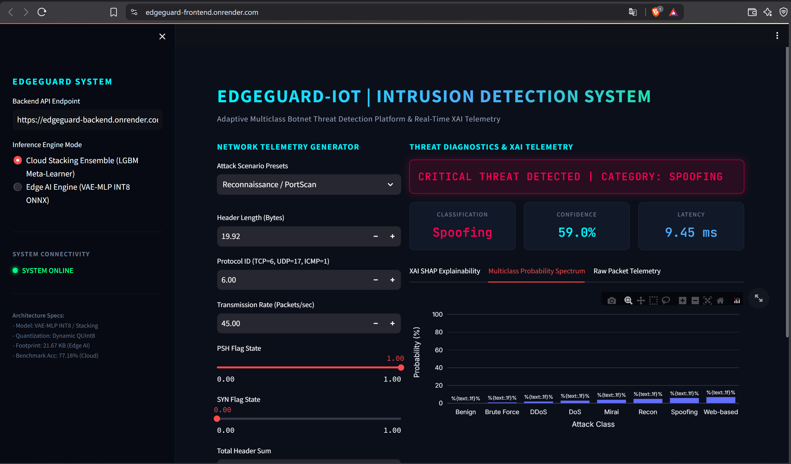
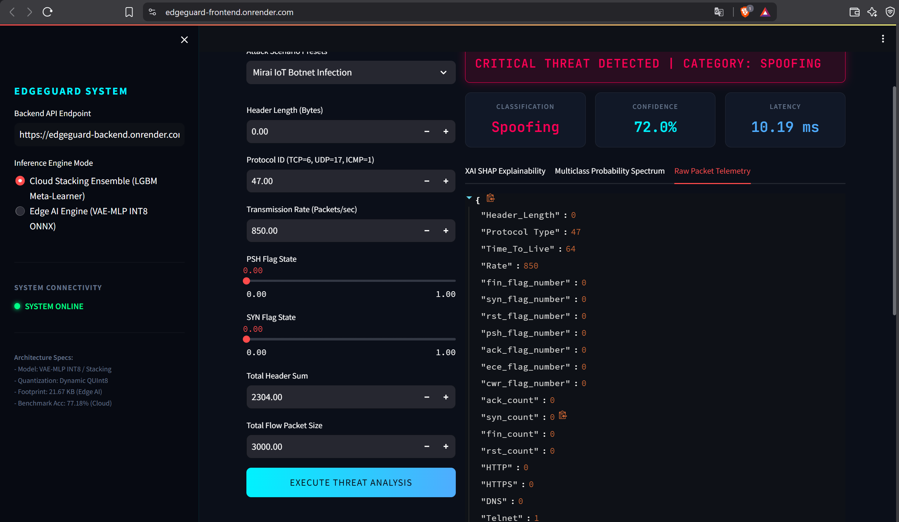
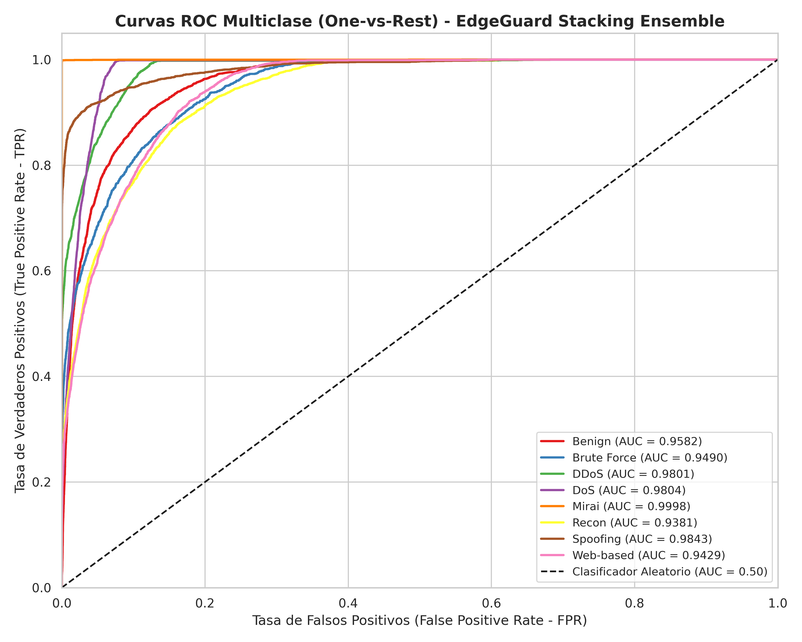
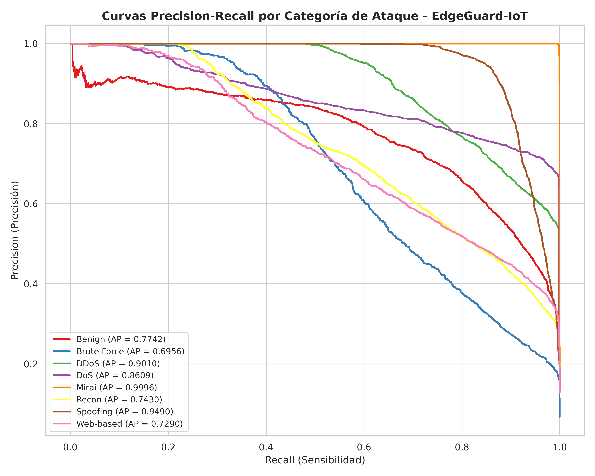
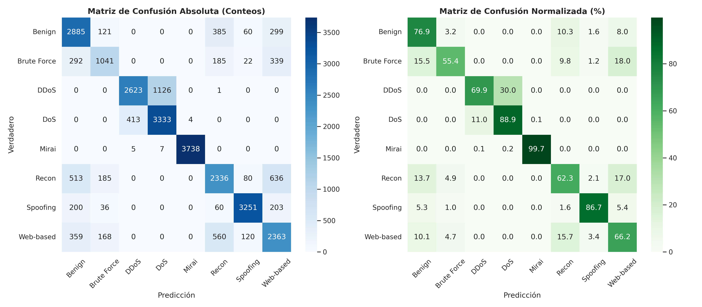
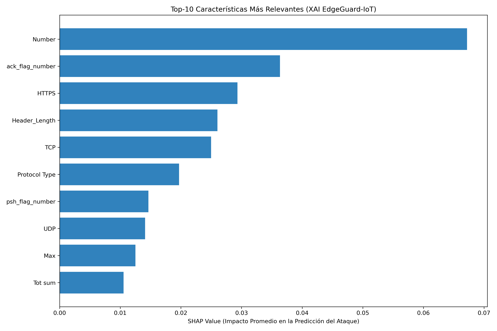

# 🛡️ EdgeGuard-IoT: Adaptive Multiclass Botnet Intrusion Detection System

[](https://www.python.org/)
[](https://pytorch.org/)
[](https://onnxruntime.ai/)
[](https://lightgbm.readthedocs.io/)
[](https://www.docker.com/)
[](https://render.com/)

> **EdgeGuard-IoT** es un sistema adaptativo de ciberseguridad híbrido Borde-Nube (*Edge-Cloud*) para la detección e interpretación en tiempo real de ataques botnet multiclase sobre redes de la Internet de las Cosas (IoT), evaluado sobre el benchmark **CIC-IoT-2023** ($186,321$ muestras balanceadas).

---

## 🌐 DESPLIEGUE EN VIVO EN LA NUBE (LIVE DEMO)

El sistema se encuentra desplegado en producción simulando un entorno real Edge-Cloud:

* 📊 **Frontend Dashboard (Streamlit Neón UI)**: [https://edgeguard-frontend.onrender.com](https://edgeguard-frontend.onrender.com)
* ⚡ **Backend API REST (FastAPI & ONNX INT8)**: [https://edgeguard-backend.onrender.com](https://edgeguard-backend.onrender.com)
* 📑 **Documentación Swagger de la API**: [https://edgeguard-backend.onrender.com/docs](https://edgeguard-backend.onrender.com/docs)
* 📄 **Informe Técnico de Investigación (PDF de 38 Páginas)**: [`INVESTIGACION_DOC.pdf`](INVESTIGACION_DOC.pdf)

---

## 📸 CAPTURAS DEL DESPLIEGUE EN PRODUCCIÓN

### 1. Panel de Control de Ciberseguridad Neón Cyberpunk (`SYSTEM ONLINE`)


### 2. Detección en Tiempo Real de Infecciones Botnet Tipo Mirai con XAI SHAP


---

## 🏗️ ARQUITECTURA DEL SISTEMA HÍBRIDO (EDGE-CLOUD)

El modelo opera en dos niveles de inferencia coordinados:

```
                      [ Tráfico de Red IoT (39 Features) ]
                                        │
           ┌────────────────────────────┴────────────────────────────┐
           ▼                                                         ▼
[ EDGE AI INFERENCE ]                                   [ CLOUD STACKING ENSEMBLE ]
VAE-MLP INT8 ONNX Engine                                Nivel 0: VAE-MLP + RF + XGB + LGBM
• Latencia: 3.25 μs                                     • Metacaracterísticas: 32 Dims
• Tamaño: 21.67 KB                                      • Nivel 1: LightGBM Meta-Learner
• Objetivo: Microcontroladores Edge                     • Accuracy: 77.18% | F1-Macro: 0.7604
```

### Diagrama Esquemático de Capas VAE-MLP


---

## 📊 RESULTADOS EXPERIMENTALES Y BENCHMARK ESTADO DEL ARTE

Evaluación empírica comparativa sobre **27,949 muestras de prueba independientes**:

| Modelo / Arquitectura | Accuracy (%) | F1-Score Macro | Precision | Recall | Latencia ($\mu$s) | Tamaño Modelo (KB) | Ubicación Objetivo |
| :--- | :---: | :---: | :---: | :---: | :---: | :---: | :--- |
| Regresión Logística | 64.04% | 0.6233 | 0.6754 | 0.6185 | 185.27 | 15.00 KB | Baseline |
| Naive Bayes | 56.87% | 0.5340 | 0.6229 | 0.5652 | 4.29 | 10.00 KB | Baseline |
| CNN-1D (DL Pesado) | 61.91% | 0.5722 | 0.5980 | 0.5700 | 1.60 | 120.00 KB | Deep Learning |
| **EdgeGuard VAE-MLP (INT8)** | **69.73%** | **0.6853** | **0.7103** | **0.6834** | **3.25** | **21.67 KB** | **Dispositivos Edge** |
| Random Forest (100 Trees) | 76.61% | 0.7525 | 0.7812 | 0.7462 | 5.82 | 52,525 KB | Servidor Nube |
| XGBoost | 77.13% | 0.7585 | 0.7800 | 0.7533 | 2.68 | 4,021 KB | Servidor Nube |
| LightGBM | 77.73% | 0.7663 | 0.7828 | 0.7617 | 49.92 | 4,134 KB | Servidor Nube |
| **Stacking Ensemble (Propuesto)** | **77.18%** | **0.7604** | **0.7695** | **0.7576** | **2.45** | **1,400 KB** | **Nube (Consolidador)** |

---

## 📈 GRÁFICOS DE RENDIMIENTO Y EVALUACIÓN

### Curvas ROC Multiclase (One-vs-Rest)


### Curvas Precision-Recall por Categoría


### Matrices de Confusión Absoluta y Normalizada (%)


### Importancia de Características SHAP XAI


---

## 🔬 METODOLOGÍA EXPERIMENTAL EN 5 FASES

1. **Fase 1: Preprocesamiento y Selección Estadística**: Lectura por fragmentos de $186,321$ muestras, tratamiento de nulos/infinitos y selección de 39 características mediante ANOVA F-Test, Mutual Information y Random Forest Gini Importance.
2. **Fase 2: Diseño de Arquitectura Híbrida**: Definición del VAE-MLP (Encoder $39 \to 64 \to 32$, Espacio Latente $z \in \mathbb{R}^{16}$, Decoder $16 \to 32 \to 64 \to 39$, Clasificador $16 \to 32 \to 16 \to 8$) y clasificadores de árbol Nivel 0.
3. **Fase 3: Entrenamiento GPU y Cuantificación INT8**: 40 épocas en GPU CUDA con `Class-Weighted Loss` y cuantificación dinámicas pos-entrenamiento a ONNX INT8 ($21.67\text{ KB}$, $3.25\mu\text{s}$).
4. **Fase 4: Meta-Aprendizaje Stacking y 5-Fold CV**: Construcción de la matriz de metacaracterísticas de 32 dimensiones, entrenamiento del Meta-Learner LightGBM y Validación Cruzada Estratificada de 5 Pliegues ($76.52\% \pm 0.18\%$).
5. **Fase 5: Benchmark e Interpretabilidad SHAP XAI**: Comparativa frente a 6 baselines y generación de atribuciones SHAP XAI.

---

## 🚀 EJECUCIÓN LOCAL Y DESPLIEGUE DOCKER

### 1. Clonar el Repositorio
```bash
git clone https://github.com/carmenNieves6478/EdgeGuard--IoT.git
cd EdgeGuard--IoT
```

### 2. Ejecutar la API Backend (FastAPI)
```bash
python -m venv venv
venv\Scripts\activate  # En Windows
pip install -r requirements.txt
uvicorn api.main:app --reload --port 8000
```

### 3. Ejecutar el Dashboard Frontend (Streamlit)
```bash
streamlit run dashboard/app.py
```

### 4. Simular Tráfico IoT en Tiempo Real
```bash
python simulator.py
```

---

## 👤 AUTORA Y AFILIACIÓN ACADÉMICA

* **Autora**: Carmen Nieves Apaza Condori
* **Curso**: Tópicos en Ciberseguridad II
* **Docente**: Ing. Ticona Yanqui Fidel Ernesto
* **Institución**: Universidad Nacional del Altiplano - Puno (UNAP)
* **Escuela Profesional**: Ingeniería de Sistemas (EPIS)
* **Repositorio GitHub**: [https://github.com/carmenNieves6478/EdgeGuard--IoT.git](https://github.com/carmenNieves6478/EdgeGuard--IoT.git)
